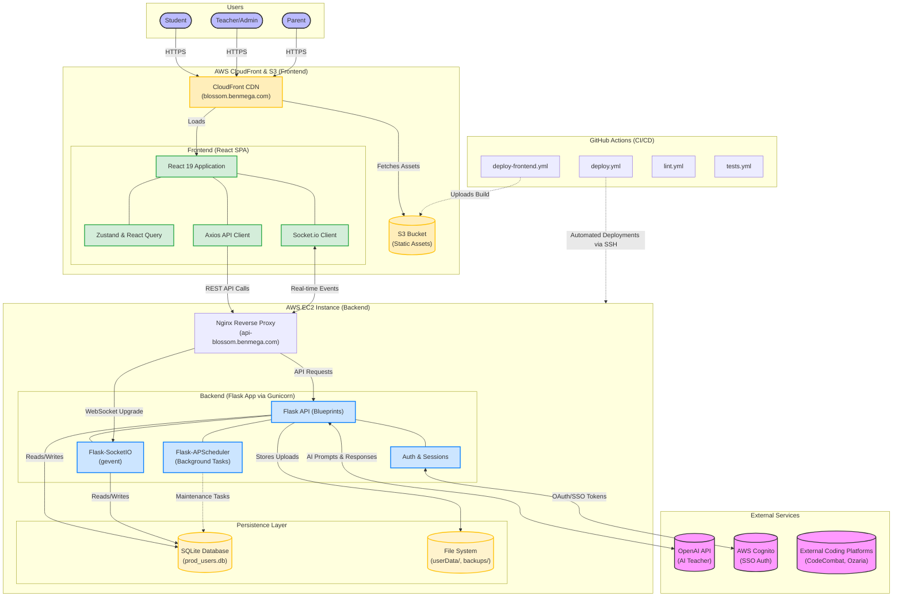

# System Architecture - Classroom Chat

This document provides a comprehensive overview of the system architecture for **Classroom Chat**, detailing its components, their interactions, data flows, and the underlying infrastructure.

## Architectural Diagram

The following Mermaid diagram illustrates the high-level architecture of the system:

---

## 1. High-Level Architecture Overview

Classroom Chat is built as a **Decoupled Single-Page Application (SPA)** architecture, consisting of a React-based frontend and a Flask-based backend API. They are hosted separately and operate independently:
- **Frontend** is hosted as static assets in an **AWS S3** bucket and served globally via **AWS CloudFront** (`blossom.benmega.com`). It handles the user interface, state management, and real-time updates.
- **Backend** is hosted on an **AWS EC2** instance, acting as the authoritative API and WebSocket server (`api-blossom.benmega.com`). It enforces business logic, database transactions, and integrations with third-party services.

## 2. Frontend Architecture (React SPA)
The frontend is designed for fluid, real-time interactivity, built with **React 19** and bundled via **Vite**.

- **Routing**: Handled by **React Router 7**, enabling seamless navigation without page reloads.
- **State Management**:
  - **Zustand**: Manages lightweight global state (e.g., authentication status, UI toggles).
  - **React Query (TanStack Query)**: Handles server-state caching, fetching, and data synchronization for API requests.
- **Data Communication**:
  - **Axios**: Used for standard REST API requests, sending credentials (cookies) securely to the backend.
  - **Socket.io Client**: Maintains a persistent connection to the backend for real-time chat, notifications, and dynamic updates.

## 3. Backend Architecture (Flask API)
The backend is a monolithic API built with **Flask 3.1.1**, leveraging an **Application Factory** pattern to keep configuration modular.

- **Routing (Blueprints)**: Endpoints are divided into logical modules (`user`, `admin`, `message`, `ai`, `shop`, etc.) allowing for clear separation of concerns.
- **Real-Time Communication**: Uses **Flask-SocketIO** with `gevent` for asynchronous event handling. Conversations use socket rooms to isolate message broadcasts.
- **Background Tasks**: Managed by **Flask-APScheduler** to execute periodic maintenance and updates independently of user requests.
- **Security & Auth**:
  - Integrates with **AWS Cognito** for SSO flows.
  - Secures routes with cookie-based Flask sessions, CSRF protection via Flask-WTF, and rate limiting via Flask-Limiter.
- **AI Integration**: The `ai` module interfaces with the **OpenAI API** to provide an intelligent "AI Teacher" within chat interfaces.

## 4. Persistence Layer
- **Relational Data (SQLite)**: The application utilizes **SQLite** (managed via SQLAlchemy ORM). The database file (`prod_users.db`) resides in the backend's `instance/` folder. This choice prioritizes simplicity and portability over distributed scaling.
- **File System**: User uploads (profile pictures, project images) are saved directly to the EC2 file system in the `userData/` directory.

## 5. Infrastructure & Deployment
The stack is deployed across AWS managed services and an EC2 instance.

- **Frontend Edge (S3 + CloudFront)**:
  - Static frontend files are stored in an S3 bucket.
  - CloudFront serves as a CDN, providing SSL termination and fast global delivery for `blossom.benmega.com`.
- **Backend Web Server (Nginx on EC2)**: 
  - Handles SSL termination and routes requests for `api-blossom.benmega.com`.
  - Proxies API and WebSocket traffic to the internal Gunicorn server.
- **Application Server (Gunicorn on EC2)**: Runs the Flask application, using `gevent` worker classes to support the concurrent long-polling/WebSocket connections required by Socket.IO.
- **CI/CD (GitHub Actions)**:
  - `lint.yml` and `tests.yml` enforce code quality and correctness on Pull Requests.
  - `deploy-frontend.yml` uploads the built React SPA to S3 on merging to the `deploy` branch.
  - `deploy.yml` triggers automated SSH deployments upon merging to the `deploy` branch, running the backend deployment script (`deploy.sh`) to restart services on the EC2.
