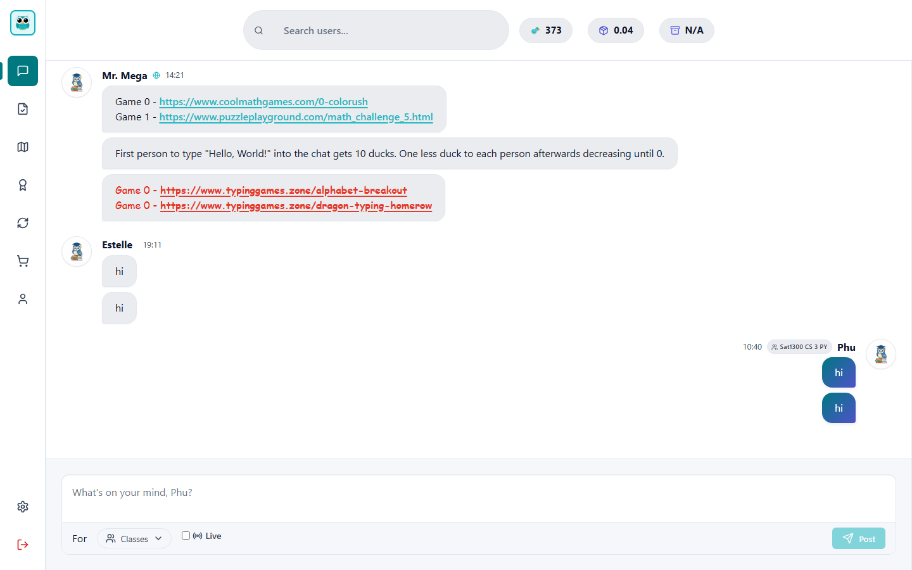

# Classroom Chat and Duck System



## Overview
Classroom Chat is a web-based application designed to enhance student interaction and engagement during class. It features real-time chat functionality, challenge tracking, and a gamified reward system called "Ducks." Students can complete challenges to earn ducks, which are displayed on their profiles.

## Core Features
- **Real-Time Chat:** Allows students to communicate seamlessly during lessons.
- **Challenge System:** Assign and track challenges with specific point values.
- **Duck Rewards:** Gamified system rewarding student achievements.
- **Profile Customization:** Users can manage their profile and view earned achievements.
- **Educational Design:** Intentional "thinking in binary" philosophy (see [EDUCATIONAL_DESIGN.md](EDUCATIONAL_DESIGN.md)).

## Quick Start

- Follow the installation guide: [INSTALLATION.md](INSTALLATION.md)
- After installing dependencies, run the backend server from the `backend` directory:

  ```bash
  cd backend
  python main.py
  ```

- In another terminal, start the frontend dev server:

  ```bash
  cd frontend
  npm run dev
  ```

- Open the app at http://localhost:5173.

## Key Technologies
- Flask (Backend)
- SQLAlchemy (Database)
- React 19 + Vite (Frontend)

## Getting Started
For detailed setup instructions, refer to [INSTALLATION.md](INSTALLATION.md).