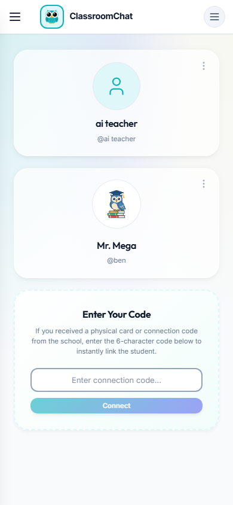

# Double Hamburger Menu on Parent Dashboard Mobile View

## Description
On mobile viewports, the Parent Dashboard displays two hamburger menu icons in the top navigation bar—one on the far left and one on the far right.

## Steps to Reproduce
1. Log in to the application as a Parent.
2. Ensure the viewport width is set to a mobile dimension (e.g., 390px).
3. Observe the top navigation header on the Parent Dashboard.

## Expected Result
A single hamburger menu icon should be present for navigation, following standard mobile UI conventions.

## Actual Result
Two hamburger menu icons are displayed simultaneously on the left and right sides of the header.

## Impact
Major - This creates a confusing and inconsistent navigation experience for parents on mobile devices.

## Screenshots

